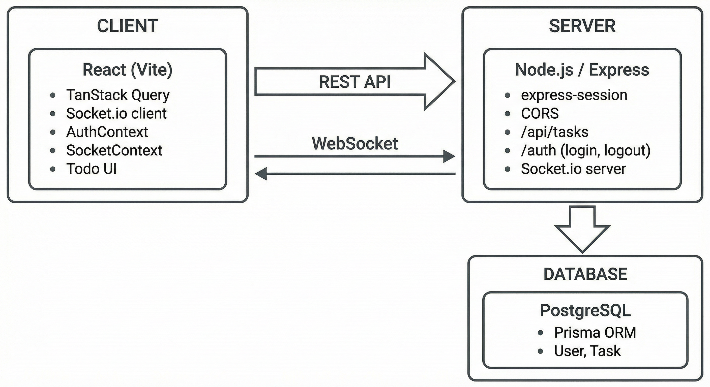

# aux-todo

## Installation

### Pre-requisites
- Node.js v24.x+
- [Corepack](https://github.com/nodejs/corepack?tab=readme-ov-file#how-to-install) 
- npm or [pnpm](https://pnpm.io/installation) package manager
- Docker

1. Clone reprository

```bash
git clone git clone git@github.com:afoon/aux-todo.git 
cd aux-todo
```

2. Install dependencies

```bash
npm install
```

3. Add an .env file
There is an `example.env` provided.

## Run the application locally
1. Run docker


2. Start development server

```bash
npm run dev
```

3. Visit application at `http://localhost:5371`

## Features

- To-do list 

- Real-time collabortion

- Authenthication

## Techincal decisions

When researching and choosing technologies, I prioritized using common technologies in industry and frameworks that are lightweight.

### Tech stack
- Node.js / ExpressJS / sockets.io
- PostgreSQL / Prisma ORM
- React.js / sockets.io

### Architecture



#### Backend

For the backend, I used Node.js, expressJS, and sockets.io. 

#### Database

I chose to use Prisma ORM to manage database updates because it generates database migration based on schema changes and doesn't require the writing of SQL queries in seperate files. For the schema, I only defined two models. The User model is a minimal, only tracking username for the sessions. Task is simple flat entity currently without any relations to User. 

#### Frontend

For the frontend, I used React.js and Sockets.io. Authethication and sockerts are managed using React Context. The todo app is managed with custom hooks. Server state is managed with TanStack React Query. I did not use any CSS frameworks and opted to write vanilla CSS. Due to the simplicity of the app, no routing was implemented.


### Time-log
| Time | Task |
| ---| ---|
| 1 hr | Research |
| 1 hr | Create monorepro and scaffold server and client |
| 2 hrs| Configure rest api, database, auth and docker containers |
| 2 hrs| Create to-do list app, enable real-time collaboration |
| 1.5 hrs | Read.me write up, clean up code | 
| 7.5 | Total time |

Work was done in 30 - 60 minutes blocks throughout the day. 

### Additional work

If I had more time, I would finish implementing Swagger UI so there would be documentation of the rest api. For the database, indexing could be add to handle larger amount of task,  enable filtering, sorting and pagination. In the frontend, I would add routing to have the authenticated features on different routes. I would also add more test.
